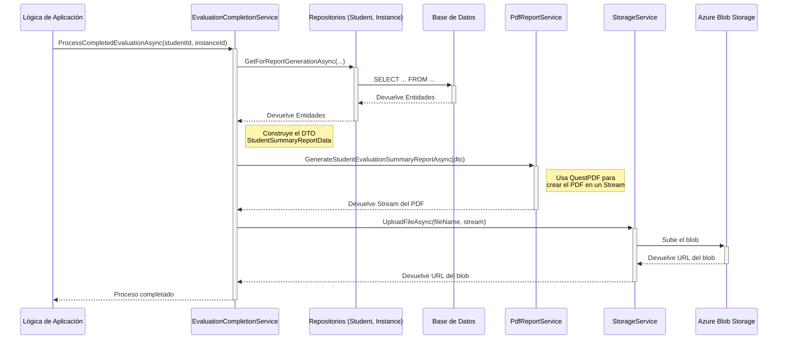

# Generación de Reportes y Almacenamiento en Azure

## 2. Componentes Principales

El proceso involucra tres servicios clave que trabajan en conjunto, cada uno con una responsabilidad única:

- `EvaluationCompletionService.cs`: Es el **orquestador** del proceso. No contiene lógica de negocio sobre cómo crear un PDF o cómo subir un archivo, simplemente coordina la secuencia de llamadas a otros servicios.
- `PdfReportService.cs`: Es el **generador** de reportes. Su única responsabilidad es recibir un conjunto de datos (DTO) y transformarlos en un archivo PDF en formato `Stream`. Utiliza la librería **QuestPDF** para construir el documento.
- `StorageService.cs`: Es el **servicio de almacenamiento**. Abstrae toda la lógica de comunicación con un proveedor de almacenamiento en la nube (en este caso, Azure Blob Storage). Su responsabilidad es recibir un `Stream` y un nombre de archivo, y devolver una URL pública o de acceso seguro.

## 3. Flujo de Trabajo Detallado

El proceso se ejecuta en una secuencia de pasos bien definida, comenzando desde la finalización de una evaluación hasta que el reporte está disponible en Azure.

### Paso 1: Inicio del Proceso

El flujo comienza cuando una parte de la lógica de negocio (por ejemplo, un `CommandHandler` o un endpoint de API) determina que una evaluación ha concluido para un estudiante. En ese momento, se invoca al método `ProcessCompletedEvaluationAsync` del servicio `EvaluationCompletionService`.

```csharp
// Ejemplo de cómo se podría llamar
await _evaluationCompletionService.ProcessCompletedEvaluationAsync(studentId, instanceId);
```

### Paso 2: Recolección de Datos

El `EvaluationCompletionService` utiliza los repositorios para recolectar toda la información necesaria de la base de datos. Para asegurar que los datos se cargan de forma eficiente y para evitar errores de referencia nula (`NullReferenceException`), se utilizan métodos de repositorio específicos:

- `IStudentRepository.GetForReportGenerationAsync(studentId)`
- `ICompetencyEvaluationInstanceRepository.GetForReportGenerationAsync(evaluationInstanceId)`

Estos métodos utilizan `Include()` y `ThenInclude()` de Entity Framework Core para cargar explícitamente todas las entidades relacionadas necesarias para el reporte en una sola consulta a la base de datos.

### Paso 3: Construcción del DTO

Con las entidades del dominio cargadas, el `EvaluationCompletionService` las mapea a un Data Transfer Object (DTO) específico para el reporte: `StudentSummaryReportData`.

Este DTO es una estructura de datos simple que contiene solo la información que el `PdfReportService` necesita para renderizar el PDF, desacoplando así la capa de generación de reportes del modelo de dominio.

### Paso 4: Generación del PDF

El DTO se pasa al `PdfReportService`. Como el método para generar este reporte detallado (`GenerateStudentEvaluationSummaryReportAsync`) es específico de esta implementación y no forma parte del contrato genérico `IReportService`, se realiza un "cast" seguro:

```csharp
if (_reportService is not PdfReportService pdfReportService)
{
    // Manejar error: el servicio de reportes configurado no es el esperado
    return;
}
using var pdfStream = await pdfReportService.GenerateStudentEvaluationSummaryReportAsync(reportData);
```

El servicio utiliza **QuestPDF** para construir el documento en memoria y devuelve un `Stream`.

### Paso 5: Almacenamiento en Azure

El `Stream` del PDF se envía al `StorageService` a través del método `UploadFileAsync`.

```csharp
var fileName = $"student-summary_{studentId}_{instanceId}_{DateTime.UtcNow:yyyyMMdd}.pdf";
var fileUrl = await _storageService.UploadFileAsync(fileName, pdfStream);
```

El `StorageService` se encarga de:

1.  Conectarse a la cuenta de Azure Storage.
2.  Seleccionar el contenedor de blobs correcto (ej. "reports").
3.  Subir el `Stream` al contenedor con el nombre de archivo especificado.
4.  Devolver la URL pública del archivo recién subido.

### Paso 6: Resultado Final

El método finaliza y, como resultado, se ha generado un reporte en PDF y se ha almacenado en Azure. La URL devuelta por el `StorageService` puede ser guardada en la base de datos o utilizada para notificar al usuario.

## 4. Diagrama de Flujo



## 5. Configuración

Para que el `StorageService` funcione, es necesario configurar la cadena de conexión de Azure Storage en el archivo `appsettings.json`:

```json
{
  "Storage": {
    "ConnectionString": "DefaultEndpointsProtocol=https;AccountName=your_account_name;AccountKey=your_account_key;EndpointSuffix=core.windows.net",
    "ReportsContainerName": "reports",
    "MaxFileSizeBytes": 5242880, // 5 MB
    "AllowedFileTypes": [".pdf", ".docx", ".png"]
  }
}
```
